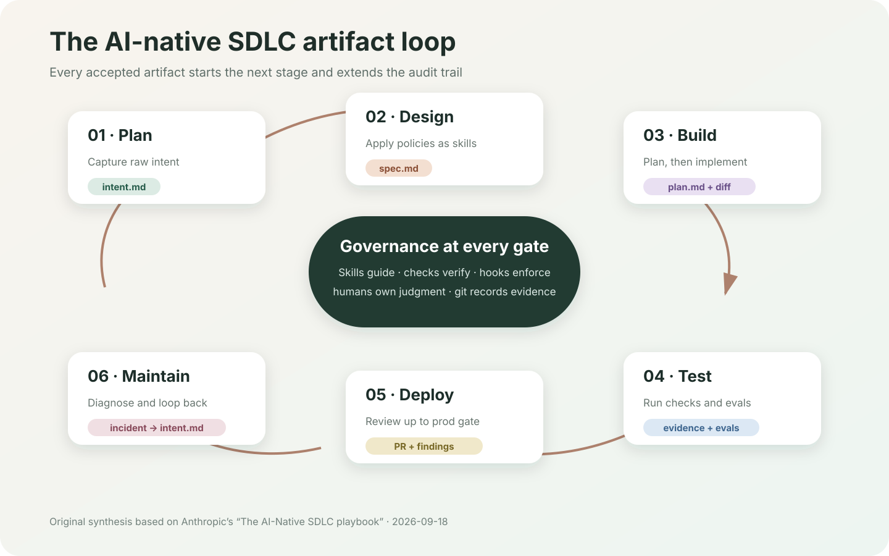
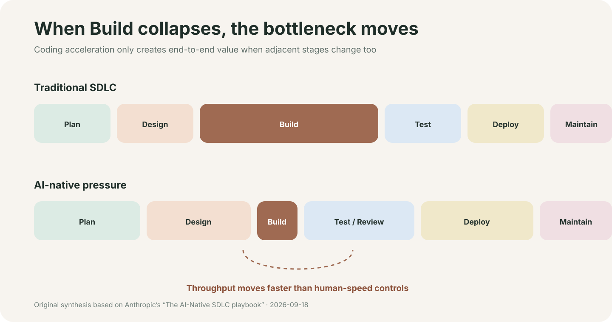

# The AI-Native SDLC playbook

> Anthropic 官方博客的结构化中文阅读笔记，不是原文镜像。为尊重版权，本页保留来源、关键事实和原创分析，配图为依据文章框架重新绘制的示意图。



## 一句话结论

当 AI 把编码压缩到小时级，真正的瓶颈会转移到规划、验证、审批和部署。AI-native SDLC 的关键不是让 Agent 多写代码，而是让每一阶段都产出版本化、机器可读、可审计的 artifact，并用自动验证和风险分级的人类关卡把它们串成闭环。

## 文章信息

- 官方标题：The AI-Native SDLC playbook
- 作者：Louis Claxton
- 发布日期：2026-08-21
- 原文：[claude.com/blog/the-ai-native-sdlc-playbook](https://claude.com/blog/the-ai-native-sdlc-playbook)
- 阅读日期：2026-09-18

## 为什么传统 SDLC 需要重构

传统流程围绕“编码昂贵且缓慢”这一前提设计：前置阶段用 PRD、估算和评审降低返工，后置阶段靠人工逐行 Review 与审批控制风险。Agentic coding 显著缩短 Build 后，这些机制没有同步提速，于是出现三类问题：

- 瓶颈移动到 Plan、Test/Review 与 Deploy；
- 逐行人工审查无法跟上 Agent 产生 diff 的速度；
- 例外仍要等待会议或委员会，治理成本反而上升。



## 六阶段框架

| 阶段 | AI-native 做法 | 主要 artifact | 人类责任 |
| --- | --- | --- | --- |
| Plan | 让需求发起者直接与 Claude 澄清问题、用户、约束和成功标准 | `intent.md` | 产品负责人纠错并决定是否接受意图 |
| Design | Agent 同时生成需求与设计，并应用安全、合规、品牌和 UX Skills | `spec.md` | 解决冲突与高风险问题，批准设计 |
| Build | 先在 Plan Mode 中形成可独立执行的方案，再生成代码 | `plan.md`、diff、测试、`CLAUDE.md`、Skills | 工程师质询方案；高风险变更由技术负责人批准 |
| Test | 把构建、测试、Lint、截图对比和 Agent evals 织入实现过程 | 验证输出、eval 结果 | 定义验收标准，处理非机械判断 |
| Deploy | 多层 Agent Review、Hooks 和分环境权限控制；Agent 只执行到生产关卡 | PR、review findings、pipeline logs | 对关键或受监管代码做风险判断，授权生产发布 |
| Maintain | 监控、工单或控制带越界触发诊断，并把结论写回新的意图 | incident record、新 `intent.md` | 对低置信度或高影响动作介入，保留责任归属 |

## Artifact chain：这篇文章最核心的设计

```text
intent.md → spec.md → plan.md → code + tests → PR + findings → incident → intent.md
```

每个阶段结束时提交一个下一阶段能读取的 artifact；提交本身既是触发器，也是审计轨迹。它记录谁提出了什么、Agent 生成了什么、采用了哪版规则，以及谁最终批准。

这使流程从“文档在不同角色间交接”变为“状态通过版本化 artifact 流动”。前半段主要是人和 Agent 都能读的 Markdown，Build 之后则以代码、测试、Review 结果和运行记录为主。

## 文章提出的关键 Plays

### 1. 用 `intent.md` 捕捉原始意图

需求发起者先用自然语言说明问题，不要求预先掌握产品或工程写作格式。Claude 负责追问范围、影响对象、约束和成功标准，产品负责人校正后提交。目标是减少需求在多轮转述中的损耗。

### 2. 把政策编码为 Skills

品牌、安全、合规、API 规范等组织知识不再只存在于 Wiki 或评审人的记忆里，而是作为版本化 Skill 在相关任务中自动加载。Skill 是指导性控制；必须强制执行的规则仍需 Hook、CI 或 PR gate。

### 3. 以 Plan Mode 作为开发默认入口

在任何写操作前，Agent 先读取 `intent.md`、`spec.md` 和代码库，写出涉及文件、执行顺序、风险、备选方案与验证方式。工程师先 Review 计划，再授权实现，从而把昂贵的代码返工转化为便宜的文档修订。

### 4. 用 `CLAUDE.md` 保存仓库级知识

它应包含新成员第一天真正需要的构建、测试、Lint 命令，关键约定、架构边界以及 Agent 经常犯的错误。文章建议保持简短，并在同一错误重复出现时把修正沉淀进去。

### 5. 让验证证据来自工具链

“完成”应由可执行检查定义，而不是 Agent 自己判断。测试、构建日志、静态检查、截图 diff 等结果随变更进入 PR。Review 人员因此可以更专注于意图、行为和风险。

### 6. 对 Agent 配置也做持续 Evals

`CLAUDE.md`、Skills、Hooks、提示词和模型更换都会改变系统行为，因此应像代码一样做回归测试。可从近期真实任务中挑选 20–50 个案例，记录预期结果，并把生产事故转成永久 eval。

### 7. 用 Hooks 与权限层级落实治理

Agent 可以在开发环境拥有更大自主权；到 Staging 收紧；生产环境则只允许准备发布，由明确的人类责任人授权。分支保护、短期凭证、沙箱、MCP 工具白名单和可演练回滚共同定义行动边界。

### 8. 从 Maintain 重新触发闭环

监控告警、Bug 工单、频道消息或计划任务可以无人工启动 Claude。Agent 诊断后不直接越权修复，而是通过确定性检查或对抗性 Review gate 决定继续还是升级给人，并把发现重新写成 `intent.md`。

## 治理模型

文章的治理逻辑可以压缩为四层：

1. **指导层**：`CLAUDE.md`、Skills、Prompt，降低错误发生概率；
2. **验证层**：测试、Lint、构建、Evals，给出可复现证据；
3. **强制层**：Hooks、分支保护、最小权限与环境隔离，阻止越界动作；
4. **责任层**：产品负责人、代码所有者、技术负责人或发布经理对需要判断的关卡签字。

一个很重要的原则是：Agent 可以行动到生产 gate，但不能自行跨过生产 gate。

## 如何衡量

| 目标 | 可观察指标 |
| --- | --- |
| Plan 提速 | 从首次讨论到 `intent.md` 提交的时间；被产品负责人接受的比例 |
| Design 减少返工 | `intent.md` 到 `spec.md` 的时间；Build 开始后的需求修改次数 |
| Build 提高一次成功率 | 首次实现即合并的比例；`plan.md` 与最终 diff 的一致性 |
| Test 提高可信度 | Agent 变更首次 CI 通过率；eval pass rate；事故进入回归集的时间 |
| Review 释放人力 | 每个 PR 的人工 Review 时间；重大问题被 Agent 提前发现的比例 |
| Deploy 改善交付 | DORA 指标；无需叫醒人工即可完成的失败初筛比例 |
| Maintain 闭环 | 平均检测/恢复时间；自动诊断后升级给人的比例；重复事故率 |

## 我的解读

### 真正的产品不是 Coding Agent，而是 Artifact Protocol

文章表面上讲 Claude Code，底层其实是在定义一套 Agent 与人协作的协议：每阶段读什么、写什么、谁批准、如何验证、失败后如何回流。工具可以替换，但 artifact contract 和责任边界更耐久。

### Markdown-first 的价值在过渡，不在形式本身

`intent.md`、`spec.md`、`plan.md` 之所以有效，是因为它们同时对人和模型可读、可以版本化，也容易接入自动化。成熟组织不必抛弃 Jira、ServiceNow 或合规系统，但必须为每类 artifact 指定唯一事实来源，并让两边通过 ID 与 commit SHA 互相链接。

### 金融场景最值得借鉴的是“自主权分层”

对于量化与中后台系统，可以把任务按数据敏感性、资金影响、可逆性和 blast radius 分级：低风险任务允许 Agent 自动执行；高风险任务只允许生成方案、证据和变更包，由指定责任人批准。这样既不把 AI 限制成补全工具，也不会把治理寄托在提示词上。

## 边界与疑问

- 文章属于厂商提出的实践框架，更多是 playbook 而不是严格的实证研究。
- Markdown artifact 可能与已有需求系统形成“双事实来源”；没有同步策略时，审计性反而下降。
- Agent Review 与生成代码若依赖相同模型或相同上下文，可能产生相关性错误，需要确定性检查或独立对抗评审。
- 自动化会提高变更吞吐量，也会放大评审、环境、凭证和可观测性中的薄弱环节。
- “生产 gate 必须由人跨过”适合作为初期原则，但长期仍需按风险等级定义，而不是把所有生产动作永久人工化。

## 建议的落地顺序

1. 从 `CLAUDE.md`、明确验证命令和 Plan Mode 开始；
2. 为一种高频政策建立 Skill，并用确定性检查兜底；
3. 选 20–50 个真实历史任务建立 Agent eval baseline；
4. 接入只读 CI 场景，例如失败归因、变更摘要和 Changelog 草稿；
5. 再开放写操作，但所有结果只进入受保护 PR；
6. 最后建设 Maintain → `intent.md` 的无人触发闭环。

## 可执行清单

- [ ] 为一个代码库建立精简 `CLAUDE.md`
- [ ] 定义 `intent.md`、`spec.md`、`plan.md` 模板及负责人
- [ ] 为每类 artifact 指定唯一事实来源
- [ ] 将“完成”改写为 Agent 可执行的验证命令
- [ ] 设置开发、测试、生产三个自主权等级
- [ ] 让生产事故自动进入 eval 回归集
- [ ] 用 DORA、返工率、Review 时间与事故率验证收益，而非只统计代码产量

## 延伸阅读

- [Claude Code best practices](https://code.claude.com/docs/en/best-practices)
- [Claude Code hooks](https://code.claude.com/docs/en/hooks)
- [Claude Code skills](https://code.claude.com/docs/en/skills)

